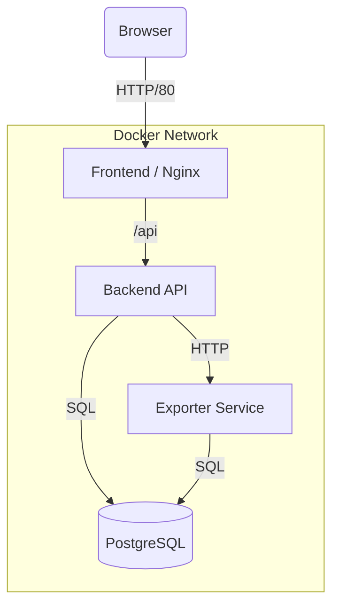

# 💰 Personal Finance Tracker

A robust, microservices-based web application for tracking income, expenses, and financial goals. Built for the "POROS Freepass 2026" competition, featuring a fully containerized architecture and automated CI/CD pipeline.

## 🏗️ Architecture

The system follows a microservices-inspired architecture, containerized using Docker. All services are orchestrated via Docker Compose and sit behind an Nginx reverse proxy (serving the frontend).

### Components

1.  **Frontend (Nginx)**: Serves static assets (HTML/CSS/JS) and acts as the entry point, routing API requests to the backend.
2.  **Backend (Node.js/Express)**: Core API service managing business logic, authentication, and database interactions.
3.  **Database (PostgreSQL)**: Persistent storage for user data, transactions, and settings.
4.  **Exporter (Python)**: Specialized microservice for generating Excel (`.xlsx`) reports from transaction data.

### Architecture Diagram



## 📂 Repository Structure

```text
.
├── .github/workflows/   # CI/CD Pipeline Configuration
│   └── deploy.yml       # Automated Build-Test-Push-Deploy Workflow
├── backend/             # Node.js Express API
│   ├── src/             # Source Code (Controllers, Models, Routes)
│   ├── tests/           # Automated Tests (Jest)
│   └── Dockerfile       # Backend Container Config
├── frontend/            # Static Web Assets
│   ├── nginx.conf       # Nginx Configuration
│   └── Dockerfile       # Frontend Container Config
├── exporter/            # Python Reporting Service
│   ├── app.py           # Service Logic
│   └── Dockerfile       # Exporter Container Config
├── db/                  # Database
│   └── init.sql         # Initial Scheme Setup
├── docs/                # Project Documentation
├── docker-compose.yml   # Local Development Orchestration
└── docker-compose.prod.yml # Production Orchestration
```

## 🚀 CI/CD Pipeline

The project uses **GitHub Actions** for continuous integration and deployment. The pipeline is strict and follows a specific sequence to ensure quality.

### Pipeline Stages

1.  **Build**: Compiles Docker images for all services to ensure they are buildable. Uses Docker layer caching for performance.
2.  **Test**: Runs automated unit and integration tests on the backend. **The pipeline stops immediately if tests fail.**
3.  **Push**: Re-builds (using cache) and pushes valid images to the **GitHub Container Registry (GHCR)**.
4.  **Deploy**: Connects to the production server via SSH, pulls the new images from GHCR, and restarts the services using Docker Compose.

### Failure Scenario

We have implemented a specific scenario to demonstrate pipeline reliability. The pipeline is designed to **fail and stop immediately** if any test in the `Test` stage fails.

For detailed instructions on how to trigger and verify this behavior, please refer to the [Failure Scenario Documentation](docs/FAILURE_SCENARIO.md).

## ⚡ Manual Setup & Execution

### Prerequisites

-   [Docker & Docker Compose](https://www.docker.com/products/docker-desktop)
-   [Git](https://git-scm.com/)

### 1. Clone the Repository

```bash
git clone https://github.com/stanislausryn/income-expense-app.git
cd income-expense-app
```

### 2. Environment Configuration

Create a `.env` file in the root directory (optional for local dev as defaults are provided in `docker-compose.yml`, but recommended for security):

```env
POSTGRES_USER=postgres
POSTGRES_PASSWORD=postgres
POSTGRES_DB=incomeexpense
JWT_SECRET=your_super_secret_key
PORT=3000
```

### 3. Run Locally

Start the entire stack using Docker Compose:

```bash
docker-compose up --build
```

-   **Frontend**: Access at `http://localhost:1292`
-   **Backend API**: Access at `http://localhost:3000`
-   **Database**: Port `5432`

### 4. Run Tests

To run the backend tests manually:

```bash
cd backend
npm install
npm test
```

*Stanislaus | 2026*
